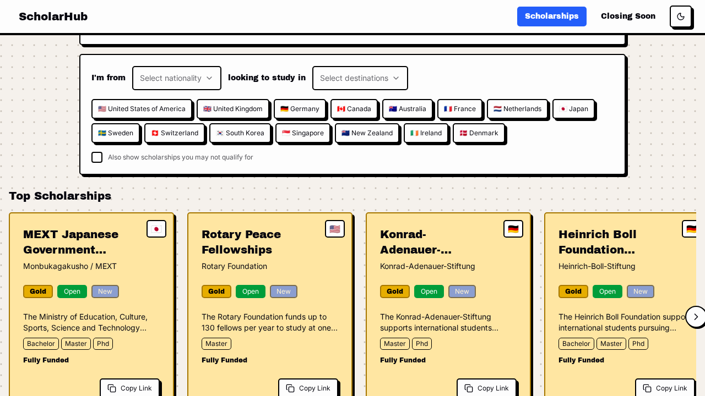
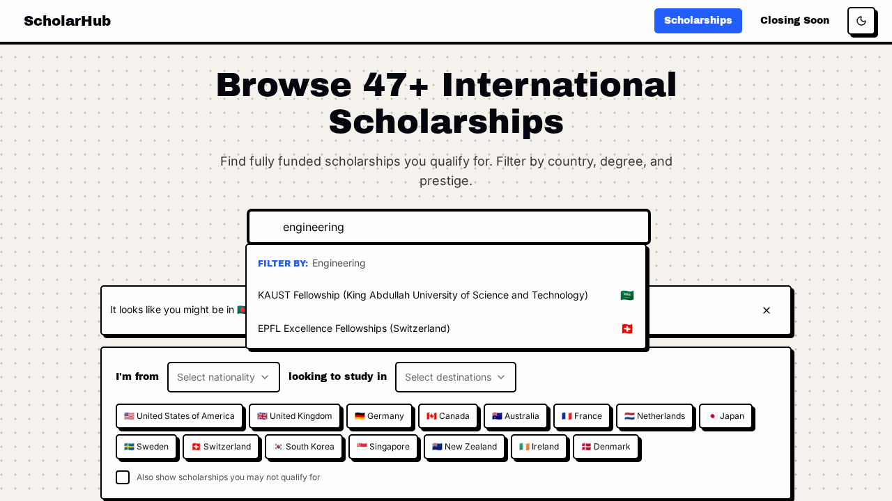
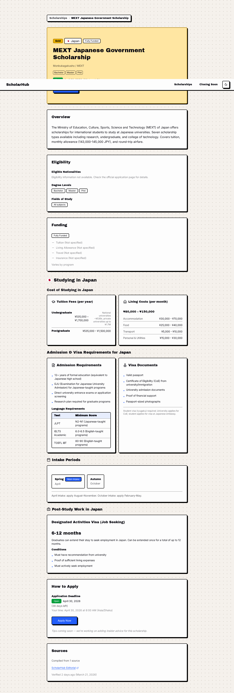
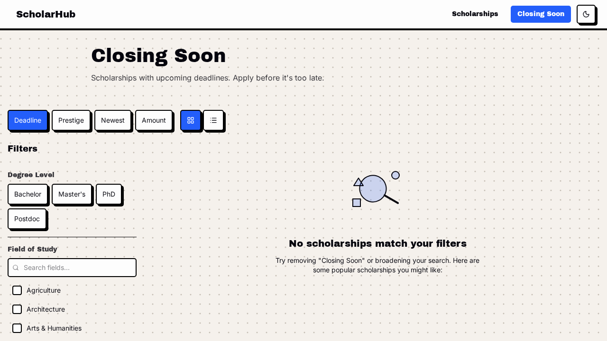

# ScholarHub

A comprehensive scholarship discovery platform that aggregates international scholarships from 272 sources, deduplicates them, and provides a fast, searchable directory for students worldwide.

**Live:** [thescholarhub.netlify.app](https://thescholarhub.netlify.app/)

---

## Screenshots

### Scholarship Directory
Browse, search, and filter scholarships by country, degree level, field of study, funding type, and prestige.



### Search & Autocomplete
Full-text search with instant autocomplete results.



### Scholarship Detail
Detailed pages with eligibility, funding breakdown, application info, and related scholarships.



### Closing Soon
Dedicated view for scholarships with upcoming deadlines.



---

## Features

### Discovery & Search
- Full-text search with autocomplete
- Filter by country, degree level (Bachelor/Master's/PhD/Postdoc), field of study, funding type, and prestige tier
- Nationality-aware recommendations (suggests scholarships you're eligible for)
- Sort by deadline, prestige, newest, or award amount
- Grid and list view toggle
- Closing Soon page for upcoming deadlines

### Country & Degree Landing Pages
- Dedicated pages per country (e.g., `/scholarships/country/uk`) and degree level (e.g., `/scholarships/degree/master`)
- Pre-filtered results with SEO-optimized metadata

### Scholarship Detail Pages
- Eligibility criteria, funding details, application timeline
- Country-specific info (cost of living, visa requirements, admission process)
- Related scholarships
- Share and copy link

### Admin Dashboard
- Review queue for pending scholarships (approve/reject/edit)
- Source trust manager (auto-publish vs manual review per source)
- Collections manager (curated, filter-based scholarship collections)
- Tags manager
- Stats bar with counts by status

### SEO
- Dynamic Open Graph image generation (Satori)
- XML sitemap with scholarship, country, and degree pages
- JSON-LD structured data
- Canonical URLs, hreflang tags, robots.txt

### Scraping Pipeline
- **272 spiders** across 5 source categories (see [Sources Covered](#sources-covered))
- 7 scraping methods: HTML (CSS selectors), API (JSON), RSS, JSON-LD, Scrapling (Cloudflare bypass), AJAX, Inertia.js
- Wave-based source scheduling (waves 1-7 by source type and priority)
- Automatic deduplication by match key (title + organization + country)
- Cycle detection for recurring annual scholarships
- Source health monitoring (consecutive failure tracking, yield analysis)
- Trust-based workflow: trusted sources auto-publish, others go to review queue

---

## Tech Stack

### Frontend
| Technology | Purpose |
|---|---|
| React 19 | UI framework |
| TanStack Start / Router | File-based routing with SSR |
| TanStack React Query | Data fetching and caching |
| Tailwind CSS 4 | Styling |
| Radix UI | Accessible components |
| Vite | Build tool |
| Netlify | Hosting with SSR via Netlify Functions |

### Backend
| Technology | Purpose |
|---|---|
| Convex | Real-time database, backend functions, full-text search |
| Satori | Server-side OG image generation |

### Scraping Pipeline
| Technology | Purpose |
|---|---|
| Python 3.12+ | Pipeline runtime |
| httpx | Async HTTP client |
| Scrapling | Cloudflare-protected site scraping |
| BeautifulSoup | HTML parsing |
| Click | CLI framework |
| structlog | Structured logging |
| Convex Python SDK | Direct database ingestion |

### Tooling
| Tool | Purpose |
|---|---|
| TypeScript | Type safety across frontend and backend |
| Vitest | Frontend tests |
| pytest | Pipeline tests |
| Ruff | Python linting and formatting |
| uv | Python package manager |
| Bun | JavaScript package manager |

---

## Project Structure

```
ScholarHub/
├── web/                              # Frontend application
│   ├── src/
│   │   ├── routes/                   # File-based routing (TanStack)
│   │   │   ├── scholarships/         # Directory, detail, country, degree pages
│   │   │   ├── admin/                # Admin dashboard
│   │   │   ├── collections/          # Curated collections
│   │   │   └── api/                  # OG images, sitemap, robots.txt
│   │   ├── components/               # React components
│   │   │   ├── admin/                # Review queue, tags manager
│   │   │   ├── directory/            # Search bar, filters, cards
│   │   │   ├── detail/               # Scholarship detail UI
│   │   │   └── comparison/           # Side-by-side comparison
│   │   ├── hooks/                    # Custom React hooks
│   │   └── lib/                      # Utilities, SEO helpers, filters
│   ├── convex/                       # Backend functions & schema
│   │   ├── schema.ts                 # Database schema
│   │   ├── directory.ts              # Scholarship queries
│   │   ├── aggregation.ts            # Deduplication & merging
│   │   ├── scraping.ts               # Pipeline ingestion endpoints
│   │   ├── admin.ts                  # Admin mutations
│   │   ├── collections.ts            # Collection CRUD
│   │   ├── seo.ts                    # Sitemap & OG data
│   │   └── tags.ts                   # Tag management
│   └── package.json
│
├── scraping/                         # Python scraping pipeline
│   ├── src/scholarhub_pipeline/
│   │   ├── cli.py                    # CLI entry point
│   │   ├── configs/                  # 272 source configurations
│   │   ├── scrapers/                 # HTML, API, RSS, JSON-LD, Scrapling scrapers
│   │   ├── pipeline/                 # Runner, scheduler, buffer
│   │   ├── ingestion/                # Convex client, batch accumulator, dedup
│   │   └── monitoring/               # Health tracking, heartbeat, rot detection
│   ├── sources/                      # Source catalogs (JSON)
│   ├── tests/
│   └── pyproject.toml
│
└── README.md
```

---

## Pipeline Architecture

```
Source Configs (272)
        │
        ▼
   ┌─────────┐     ┌──────────┐     ┌────────────┐
   │ Discover │────▶│ Schedule │────▶│   Scrape   │
   │ Configs  │     │ (Waves)  │     │ (7 methods)│
   └─────────┘     └──────────┘     └────────────┘
                                           │
                                           ▼
                                    ┌────────────┐
                                    │  Deduplicate│
                                    │  (per source)│
                                    └────────────┘
                                           │
                                           ▼
                                    ┌────────────┐
                                    │   Batch    │
                                    │  Ingest    │──────▶ Convex raw_records
                                    └────────────┘
                                           │
                                           ▼
                                    ┌────────────┐
                                    │ Aggregate  │
                                    │ & Merge    │──────▶ Convex scholarships
                                    └────────────┘
                                           │
                                           ▼
                                  ┌──────────────────┐
                                  │  Auto-publish or  │
                                  │  Review Queue     │
                                  └──────────────────┘
```

---

## Sources Covered

**272 spiders** across 5 categories:

| Category | Count | Examples |
|---|---|---|
| Official Programs | 84 | Fulbright, Rhodes, Chevening, DAAD, Erasmus Mundus, MEXT Japan, CSC China, Schwarzman, Gates Cambridge, Marshall |
| Government Portals | 75 | Turkiye Burslari, Stipendium Hungaricum, GKS Korea, Study in Germany, Campus France, JASSO, Commonwealth, Chevening, HEC Pakistan |
| Aggregators | 70 | ScholarshipPortal, StudyPortals, FindAMasters, ScholarshipDB, Fastweb, Bold.org, Niche, Scholarships.com, Opportunity Desk |
| Foundations | 35 | Aga Khan, Mastercard Foundation, Gates Cambridge, Knight-Hennessy, Ford Foundation, Wellcome Trust, Tony Elumelu, Open Society |
| Universities | 7 | Auckland, AUT, Lincoln, Massey, Otago, Victoria Wellington, Waikato (NZ focus) |

<details>
<summary>Full source list (272 spiders)</summary>

**Aggregators (70):** ScholarshipPortal, StudyPortals, FindAMasters, ScholarshipDB, Fastweb, Scholarships.com, Opportunity Desk, After School Africa, Scholarship Positions, Study Abroad Funding, Scholarships for Development, ScholarshipsIn, GoAbroad, BridgeU, Studee, MastersPortal, PhDPortal, BachelorStudies, MasterStudies, ScholarshipOwl, Niche, Bold.org, Scholarships360, InternationalScholarships.com, Buddy4Study, HeySuccess, StudyInEurope, DiscoverPhDs, AbroadPlanet, GrantWatch, Peterson's, Unigo, ProFellow, ScholarshipFellow, BachelorsPortal, BeGlobalII, Bold Scholarships, CareerOneStop, CollegeBoard, CollegeScholarships, EduPass, Euraxess, FindAPhD, FundingForStudy, GlobalScholarships, GoingMerry, GoOverseas, GrantFairy, IDP Education, IEFA, IIE Programs, InternationalScholarships, InternationalStudent, MySchoolScholarship, Opportunities for Africans, OpportunitiesCircle, OpportunitiesCorners, RaiseMe, ScholarshipRoar, ScholarshipsCanada, ScholarshipTab, Scholly, StudentScholarships, StudyAbroad, TargetStudy, TheGlobalScholarship, TopUniversities, UniEnrol, WeMakeScholars, YouthOp

**Government Portals (75):** UK Government, US State Department, Canada Global Affairs, JICA, GIZ, Study in Germany, Campus France, JASSO, CSC China, Study in Korea NIIED, Chevening, DAAD, Commonwealth, Erasmus Mundus, Turkiye Burslari, Stipendium Hungaricum, GKS Korea, EducationUSA, EduCanada, ICCR India, Study in Australia, Study in Belgium, Study in Czech Republic, Study in Hungary, Study in Italy, Study in Japan, Study in Netherlands, Study in Norway, Study in Poland, Study in Romania, Study in Russia, Study in Sweden, Study in Taiwan, Swedish Institute, Australia Awards DFAT, Australia John Allwright, Australia Research Training, Bangladesh UGC, Canada Commonwealth, Canada NRC, Canada SSHRC, Colombia ICETEX, Egypt MOHESR, ERD Bangladesh, Ethiopia Government, Ghana GETFUND, Indonesia LPDP, Ireland Government, JPSS, Jordan Government, Kenya KUCCPS, KOICA, Kuwait Government, Morocco AMCI, Nepal Government, Nigeria PTDF, NZ Scholarships, NZ Palmerston North, Oman Government, Pakistan HEC, Peru PRONABEC, Philippines CHED, Quebec PBEEE, Rwanda Government, SHED Bangladesh, South Africa DHET, Sri Lanka UGC, Argentina BECAR, Tanzania TCU, UAE MOHRE, Uganda Government, Vietnam VIED

**Official Programs (84):** Erasmus Programme, Australia Awards, KGSP Korea, New Zealand Scholarships, Sweden SI, KAAD Germany, Heinrich Böll, Konrad Adenauer, Friedrich Ebert, Rosa Luxemburg, Eiffel Excellence, Émile Boutmy Sciences Po, Irish Aid, Danish Government, Finnish Government, Czech Government, NAWA Poland, Austrian OeAD, Spanish AECID, Greek IKY, Romanian Government, Russian Government, Singapore MOE, Taiwan ICDF, Malaysia MIS, Brunei Government, Israeli Government, Mexico AMEXCID, Brazil PEC-PG, Chile AGCID, Canada Vanier, Canada Banting, OAS, AfDB JADS, IsDB, OFID, AAUW, Marshall, Mitchell, Schwarzman, Yenching Academy, Clarendon Oxford, Cambridge Trust, ETH Zurich, EPFL, Lester B. Pearson Toronto, DAFI UNHCR, Eiffel STEM, KAUST, NYU Abu Dhabi, Khalifa University, SACM Saudi, Qatar Foundation, African Union Mwalimu Nyerere, BADEA, Fulbright, Rhodes, Chevening, DAAD, Chinese Government CSC, Commonwealth, Erasmus Mundus, Holland Scholarship, Italian Government, Joint Japan/World Bank, ICCR India, Mastercard Foundation, MEXT Japan, Ontario Graduate, Ontario Trillium, Portuguese Camões, Rotary Peace, Swiss Government, Stipendium Hungaricum, Thailand TIPP, Turkiye Burslari, University of Tokyo MEXT, VLIR-UOS Belgium, ADB Japan, SEG, Shastri Indo-Canadian, Canada Anne Vallée, Ireland Walsh Scholars, Korean Arts KOFICE

**Foundations (35):** Aga Khan, Canon Collins Trust, Chevron, Coca-Cola Scholars, Dell Scholars, Ford Foundation, Gates Cambridge, Google, Heinrich Böll Stiftung, Heinrich Heine University, ICRC, Jack Kent Cooke, KAIST, Knight-Hennessy, Leverhulme Trust, Mandela Rhodes, Mastercard Foundation, Microsoft, Mo Ibrahim, Narotam Sekhsaria, Open Society, PEO International, Reach Oxford, Said Foundation, Sasakawa Peace, Skoll Foundation, Soros New Americans, Soros Refugee Students, Tony Elumelu, Trudeau Foundation, Turing AI, Wellcome Trust, African Leadership University, Dutch Bangla Bank, Islami Bank Foundation

**Universities (7):** Auckland, AUT, Lincoln, Massey, Otago, Victoria Wellington, Waikato

</details>

---

## Getting Started

### Prerequisites
- Node.js 20+ / Bun
- Python 3.12+ / uv
- Convex account

### Web App

```bash
cd web
bun install
npx convex dev    # Start Convex backend
bun run dev       # Start frontend dev server
```

### Scraping Pipeline

```bash
cd scraping
uv sync
uv run scholarhub scrape run --wave 1    # Run wave 1 sources
uv run scholarhub scrape run --source scholarshipportal  # Run single source
uv run scholarhub status                 # Check pipeline status
```

---

## Contributors

- [Aonyendo Paul Neteish](https://github.com/NitPaul) — Research

---

## License

All rights reserved.
